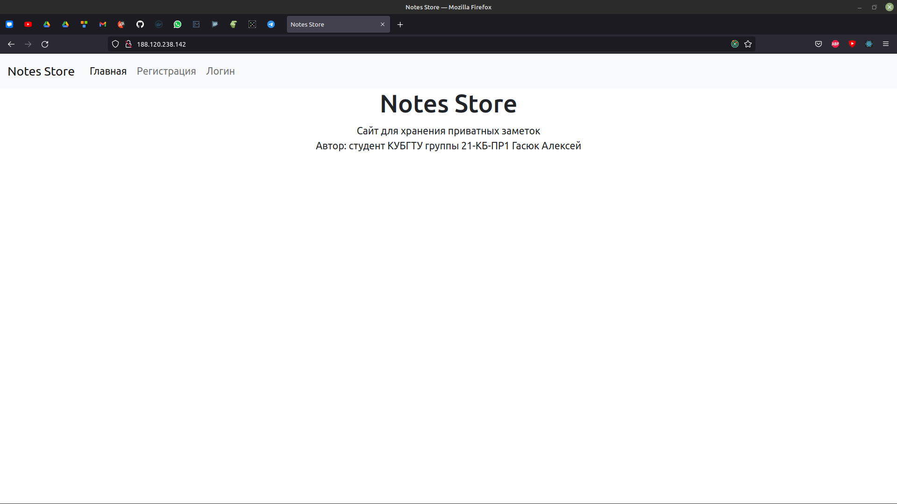

# Notes-Store
Тестовое задание (Весенний IT-интенсив от SimbirSoft)

## Развертывание
Для начала скачайте репозиторий с проектом.

```
git clone https://github.com/HexaLopata/Notes-Store.git
```

Теперь нам нужно сконфигурировать приложение.

Переходим в папку с проектом.

```
cd Notes-Store/
```

Открываем файл конфигурации в текстовом редакторе.

```
vim Notes-Store/notes_store/settings.py
```

Теперь нужно разрешить django использовать необходимый ip адрес и отключить режим Debug. Для этого меняем соответствующие строки на эти:

```python
DEBUG = False

ALLOWED_HOSTS = ['<необходимый ip адрес>']
```

Теперь соберем образ с django и активируем контейнеры.

```
sudo docker-compose build && sudo docker-compose up -d
```

Приложение должно запуститься на 80-м порту.

Теперь применим миграции

```
sudo docker exec notes-store_django_1 python manage.py makemigrations && \
sudo docker exec notes-store_django_1 python manage.py migrate
```

После этого приложение должно работать правильно.

Вы можете увидеть полностью готовое приложение по [этой ссылке](http://188.120.238.142/).

## Использованные технологии
Для улучшения фронтенд части приложения было принято решение, использовать React. 

Плюсы:

- Увеличивается скорость разработки и качество фронтенда
- Запросы весят меньше (кроме первого)
- Увеличивается потенциал развития приложения

Минусы:

- SEO

Так как приложение представляет из себя хранилище приватных заметок, SEO для нас не так важен.

Для увеличения скорости верстки и уменьшения затрат на дизайн было также принято решение, использовать bootstrap.

Общий список технологий (backend):

- Django
- Django Rest Framework
- PostgreSQL
- Docker с Docker-Compose

Общий список технологий (frontend):

- React
- Redux c Redux-Thunk
- React-Router
- React-Bootstrap
- Webpack

## Описание
При первом входе на сайт вы увидите следующие страницы.




Если вы вводите неверные данные в какую-то из форм (пустые строки или существующий пользователь при регистрации), то приложение выведет текст с ошибкой.


После успешного логина вы будете направлены на главную страницу.


После этого в навигационной панели появятся новые страницы.


Структура заметки состоит из:

- Заголовка
- Содержимого
- Даты создания (устанавливается автоматически)
- Приоритета

По аналогии с выводом ошибок приложение также предусматривает вывод прочей информации.


Как видно из рисунка выше, заметки можно сортировать по приоритету и дате создания. Заметку также можно удалить. Цвет линии вверху заметки зависит от приоритета. Всего есть 3 цвета.

Благодаря bootstrap приложение полностью адаптивно.


